# Eleedom IMF System Architecture and Data Flow Documentation

<!-- _class: lead -->

---

## System Overview

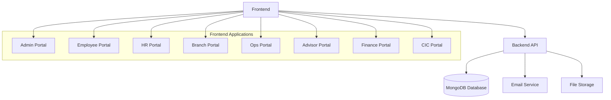

---

## Authentication Flow

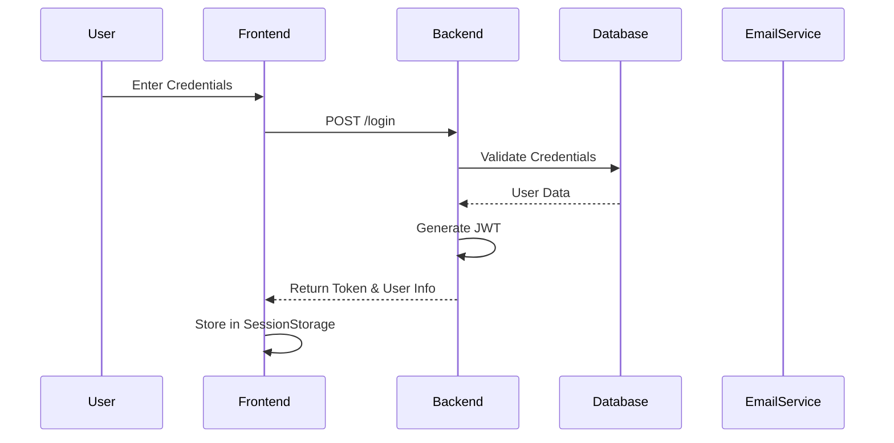

---

## User Management Flow

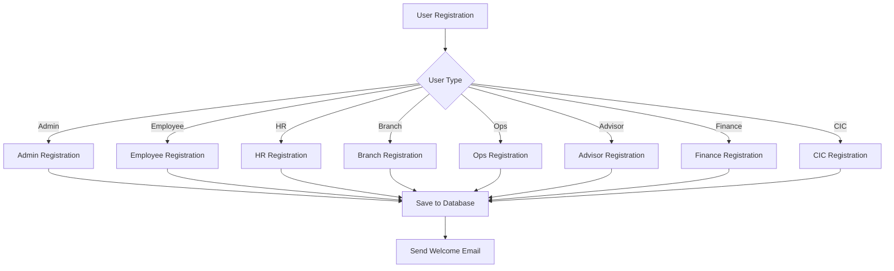

---

## Password Reset Flow

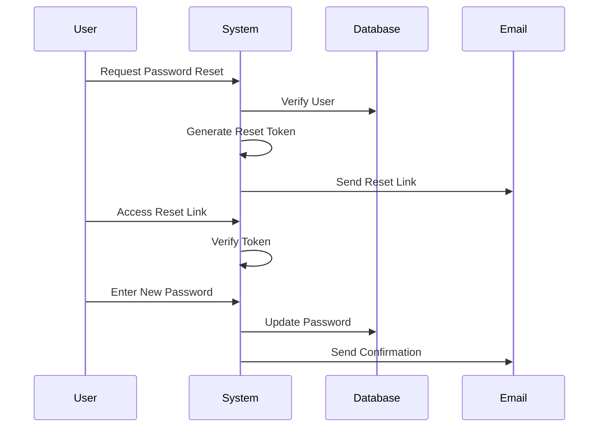

---

## Policy Management Flow

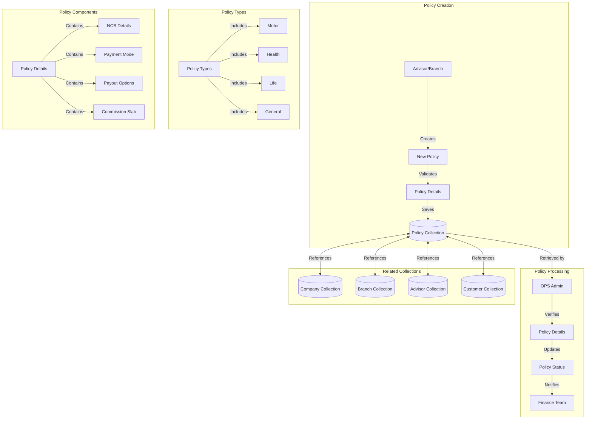

---

## Policy Data Flow

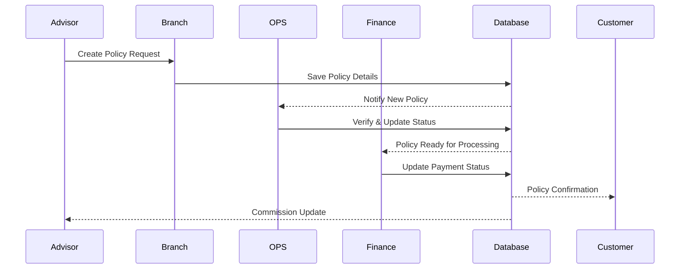

---

## Policy Collection Schema Overview

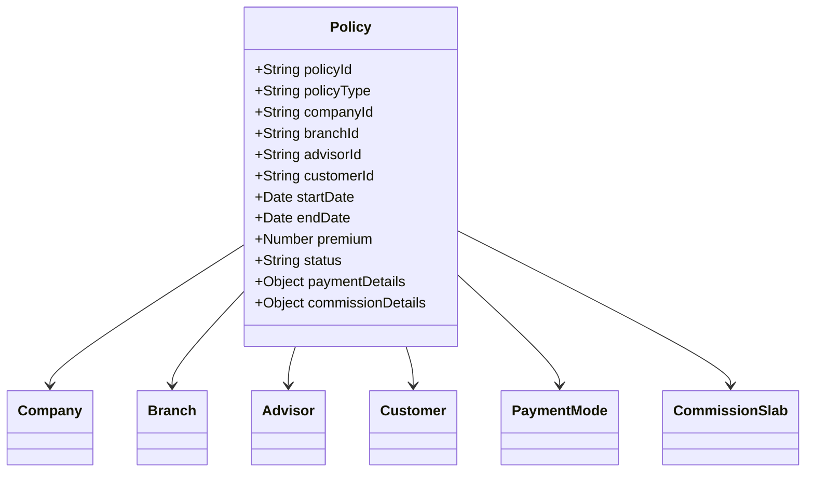

---

## Data Models

### User Authentication
- Admin
- Employee
- HR Admin
- Branch
- Ops Admin
- Advisor
- Finance
- CIC

### Core Entities
- Company
- Branch
- Policy
- Employee
- Attendance
- Salary
- Leave Balance

---

## API Endpoints

### Authentication Routes
- POST /loginadmin - Admin login
- POST /login/employee - Employee login
- POST /hradmin/login - HR login
- POST /branches/loginbranch - Branch login
- POST /ops/login - Ops login
- POST /advisor/login - Advisor login
- POST /finance/login - Finance login
- POST /cic/login - CIC login

### Password Management
- POST /forgot/{user-type}/pass - Initiate password reset
- POST /{user-type}/pass/:id/:token - Reset password

### Employee Management
- POST /dashboard/addemployee - Add new employee
- GET /employees/data - List employees
- PUT /api/employee/update/:id - Update employee
- DELETE /employee/data/:id - Delete employee

### Branch Management
- POST /dashboard/addBranch - Add new branch
- GET /api/branch-list - List branches
- PUT /api/branch/update/:id - Update branch
- DELETE /dashboard/api/:id - Delete branch

---

## Security Implementation

1. Authentication
   - JWT based authentication
   - Token expiration: 8-24 hours
   - Session storage for token management

2. Password Security
   - Bcrypt password hashing
   - Salt rounds: 10
   - Password reset tokens with 15-minute expiration

3. Email Notifications
   - Welcome emails
   - Password reset links
   - Account updates

---

## Database Collections

1. Users Collections:
   - admins
   - employees
   - hradmins
   - branches
   - opsadmins
   - advisors
   - finance
   - cic

2. Operational Collections:
   - policies
   - attendance
   - salaries
   - leaves
   - branches
   - companies

---

## Component Details Documentation

### Portal Components

```mermaid
graph TD
    subgraph Admin Portal
        AD[Admin Dashboard] --> AUM[User Management]
        AD --> ABM[Branch Management]
        AD --> ACM[Company Management]
        AD --> APM[Policy Management]
        AD --> ASM[System Settings]
    end

    subgraph Employee Portal
        ED[Employee Dashboard] --> EP[Profile]
        ED --> EA[Attendance]
        ED --> EL[Leave Management]
        ED --> ES[Salary Details]
        ED --> EDR[Daily Reports]
    end

    subgraph HR Portal
        HR[HR Dashboard] --> HEM[Employee Management]
        HR --> HAM[Attendance Management]
        HR --> HSM[Salary Management]
        HR --> HLM[Leave Management]
        HR --> HHM[Holiday Management]
        HR --> HOL[Offer Letters]
    end

    subgraph Branch Portal
        BD[Branch Dashboard] --> BPM[Policy Management]
        BD --> BAM[Advisor Management]
        BD --> BCM[Customer Management]
        BD --> BDR[Daily Reports]
        BD --> BFM[Financial Reports]
    end

    subgraph Ops Portal
        OD[Ops Dashboard] --> OPV[Policy Verification]
        OD --> OCF[Claim Forms]
        OD --> OIF[Indorsement Forms]
        OD --> ODV[Daily Visits]
        OD --> OCA[Cancellation Forms]
    end

    subgraph Advisor Portal
        ADV[Advisor Dashboard] --> ADVP[Policy Creation]
        ADV --> ADVC[Customer Management]
        ADV --> ADVR[Reports]
        ADV --> ADVCOM[Commission Details]
        ADV --> ADVT[Targets]
    end

    subgraph Finance Portal
        FD[Finance Dashboard] --> FPP[Policy Processing]
        FD --> FCP[Commission Processing]
        FD --> FDL[Daily Ledger]
        FD --> FFR[Financial Reports]
        FD --> FPM[Payment Management]
    end

    subgraph CIC Portal
        CIC[CIC Dashboard] --> CICP[Policy Processing]
        CIC --> CICF[Form Management]
        CIC --> CICR[Reports Generation]
        CIC --> CICD[Document Verification]
    end
```

---

### Master Components

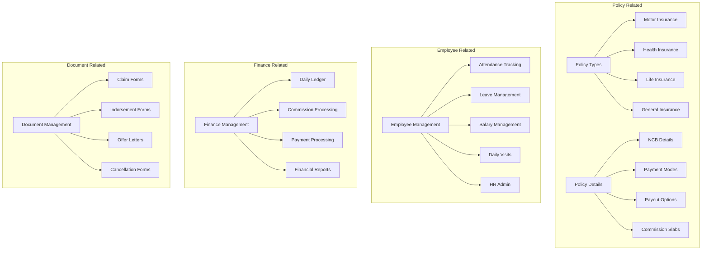

---

### Component Relationships

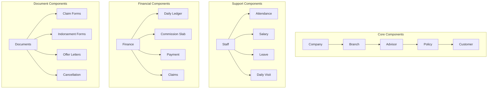

---

### Data Flow Between Components

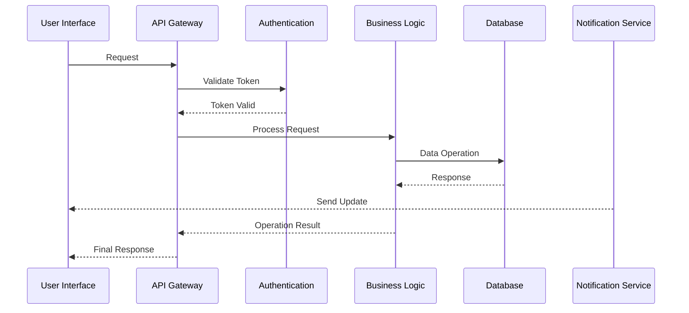

---

### Component Access Control

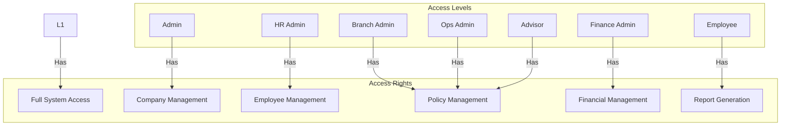

---

## Component Integration

### Frontend-Backend Integration
- RESTful API endpoints for each component
- JWT-based authentication
- Real-time updates using WebSocket
- File upload/download capabilities
- State management using Redux

### Database Integration
- MongoDB collections for each component
- Relationship mapping between collections
- Indexing for performance optimization
- Data validation at schema level
- Automated backup system

### External Service Integration
- Email service for notifications
- SMS gateway for alerts
- Payment gateway integration
- Document storage service
- Report generation service

---

## API Component Flow Architecture 

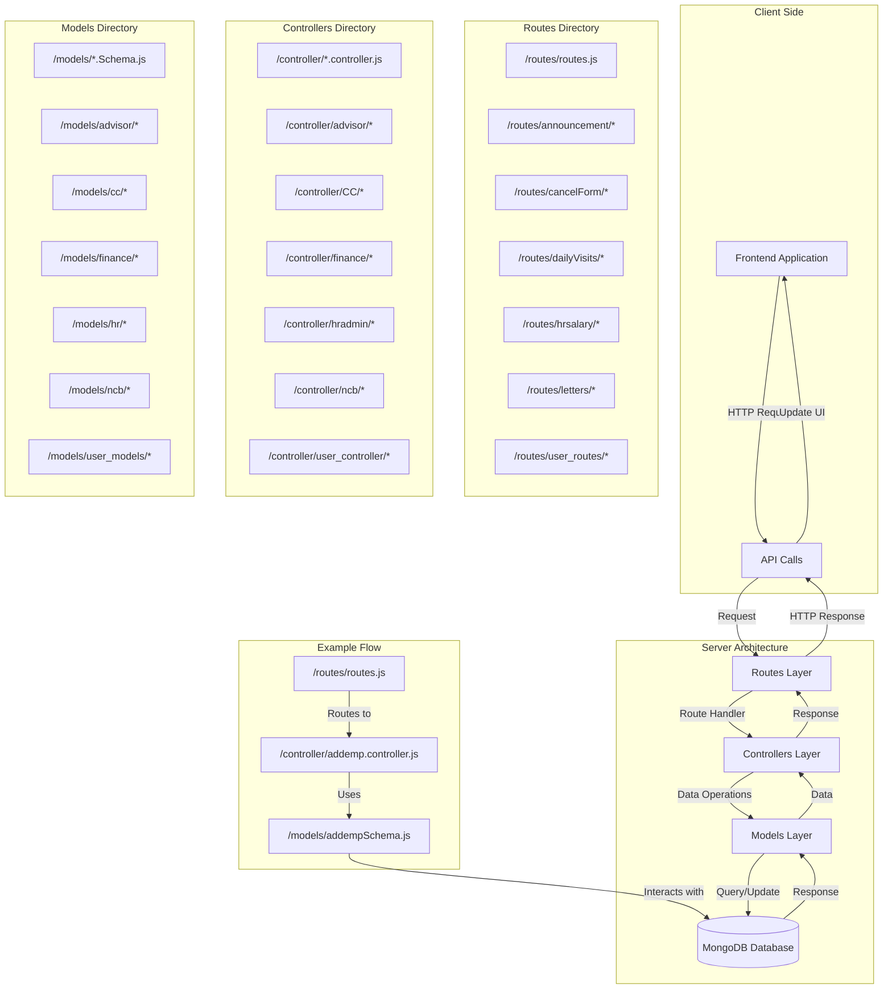

---

## API Flow Examples

### Employee Management Flow
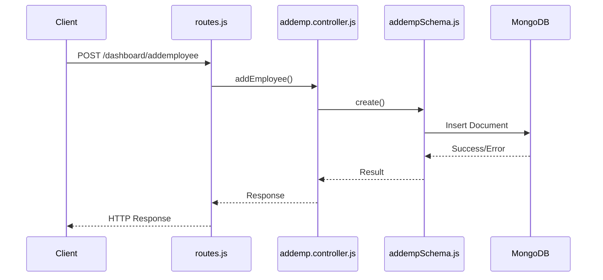

### Policy Management Flow
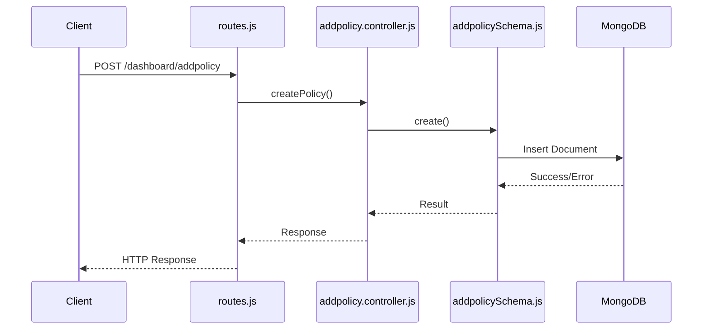

---

## Detailed API Documentation

### Authentication APIs

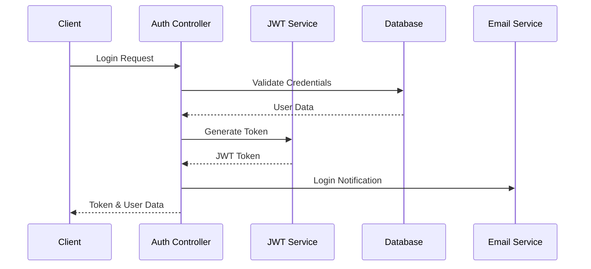

#### Login Endpoints
| Endpoint | Method | Description | Request Body | Response |
|----------|--------|-------------|--------------|-----------|
| /loginadmin | POST | Admin login | {email, password} | {token, userData} |
| /login/employee | POST | Employee login | {email, password} | {token, userData} |
| /hradmin/login | POST | HR login | {email, password} | {token, userData} |
| /branches/loginbranch | POST | Branch login | {email, password} | {token, userData} |

### Policy Management APIs

#### Policy Creation Flow
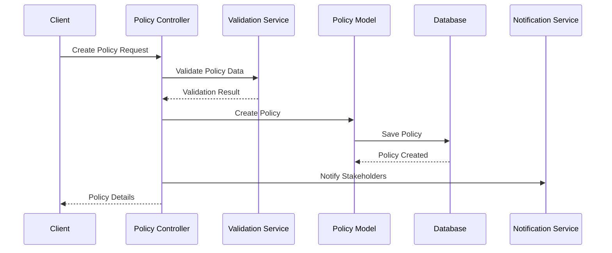

#### Policy Endpoints
| Endpoint | Method | Description | Request Body | Response |
|----------|--------|-------------|--------------|-----------|
| /policy/create | POST | Create new policy | Policy Object | Created Policy |
| /policy/:id | GET | Get policy details | - | Policy Details |
| /policy/:id | PUT | Update policy | Updated Fields | Updated Policy |
| /policy/:id | DELETE | Delete policy | - | Success Status |

## Data Validation Implementation

### Input Validation
```typescript
interface PolicyValidation {
    validatePolicyData(data: PolicyInput): ValidationResult;
    validateCustomerDetails(customer: CustomerInput): ValidationResult;
    validatePaymentDetails(payment: PaymentInput): ValidationResult;
}

interface ValidationResult {
    isValid: boolean;
    errors?: ValidationError[];
}

interface ValidationError {
    field: string;
    message: string;
    code: string;
}
```

### Database Schema Validation
```javascript
const policySchema = new Schema({
    policyNumber: {
        type: String,
        required: true,
        unique: true,
        validate: {
            validator: function(v) {
                return /^POL-\d{6}$/.test(v);
            },
            message: props => `${props.value} is not a valid policy number!`
        }
    },
    // ... other fields
});
```

## Error Handling Architecture

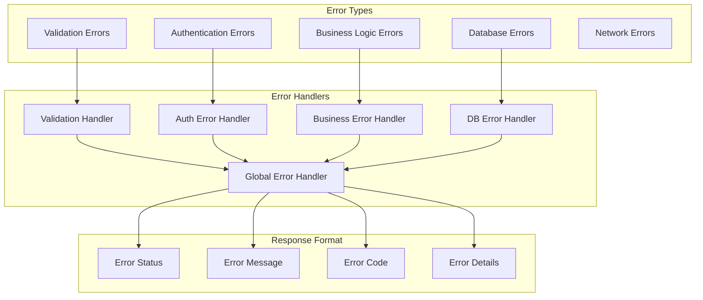

### Error Response Format
```typescript
interface ErrorResponse {
    status: number;
    code: string;
    message: string;
    details?: {
        field?: string;
        reason?: string;
        suggestion?: string;
    }[];
    timestamp: string;
    requestId: string;
}
```

## Security Implementation Details

### Authentication Flow
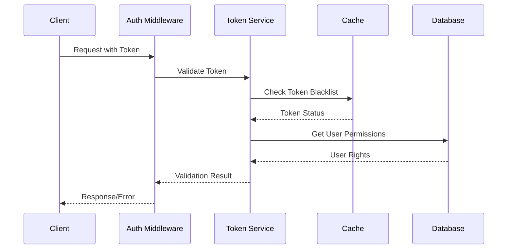

### Security Measures
1. Token Management
   ```typescript
   interface TokenService {
       generateToken(payload: TokenPayload): string;
       validateToken(token: string): ValidationResult;
       refreshToken(oldToken: string): string;
       revokeToken(token: string): void;
   }
   ```

2. Password Security
   ```typescript
   interface PasswordService {
       hashPassword(password: string): Promise<string>;
       verifyPassword(password: string, hash: string): Promise<boolean>;
       generateResetToken(): string;
       validatePasswordStrength(password: string): ValidationResult;
   }
   ```

### Database Indexing
```javascript
// Example Index Definitions
db.policies.createIndex({ policyNumber: 1 }, { unique: true });
db.policies.createIndex({ customerId: 1 });
db.policies.createIndex({ createdAt: -1 });
db.policies.createIndex({ 
    branchId: 1, 
    status: 1, 
    createdAt: -1 
});
```

## Monitoring and Logging

### Log Structure
```typescript
interface LogEntry {
    timestamp: Date;
    level: 'INFO' | 'WARN' | 'ERROR' | 'DEBUG';
    service: string;
    operation: string;
    requestId: string;
    userId?: string;
    message: string;
    metadata?: Record<string, any>;
}
```

### Monitoring Metrics
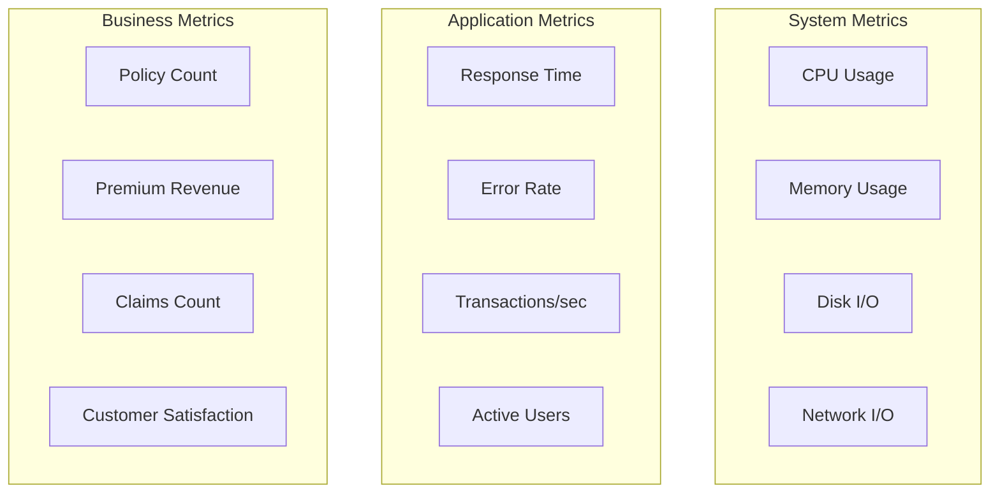
